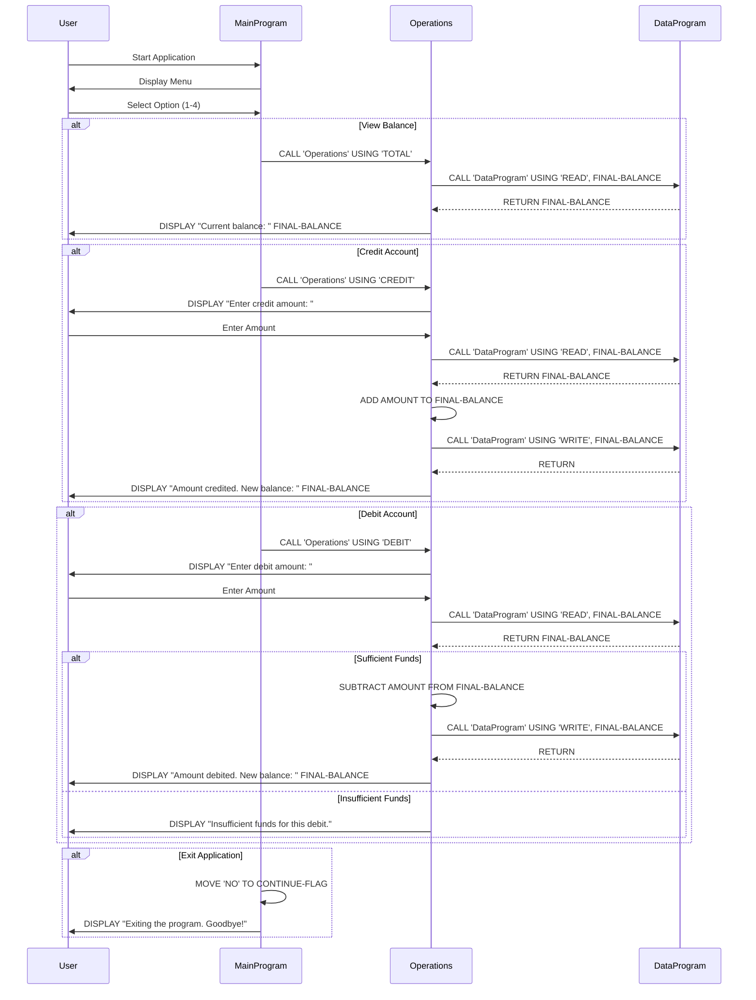

# Modernizing a Cobol accounting system to a C# or Node.js application using GitHub Copilot

This repo contains COBOL code for a simple accounting system. You can use GitHub Copilot to transform this code to a Node.js accounting system.

**Note: Keep in mind GitHub Copilot is an AI pair programmer that helps you write code. It is not a code generator and is using generative
models trained on public code. It may provide completions that are not perfect, safe, or otherwise suitable for production. Always review suggestions
and take a trust but verify approach.**


## Prerequisites

- Basic understanding of programming concepts.
- GitHub Copilot or GitHub Copilot Chat installed in your IDE.

## Nice-to-haves
- Basic understanding of the COBOL programming language.
- Knowledge of C# or node.js

## Setup the development environment

### Option 1: Use an IDE that supports GitHub Copilot

- IDE options for both GitHub Copilot and Copilot Chat:
  -  Visual Studio Code
  -  Visual Studio
  -  JetBrains IDE

#### For Visual Studio Code

- Install the GitHub Copilot and GitHub Copilot Chat extensions for Visual Studio Code.
- Install a COBOL extension for Visual Studio Code.

## About the program

This COBOL program simulates an account management system. This program will involve multiple COBOL source files and perform various operations like crediting, debiting, viewing the balance, and even exiting the program. Here’s how you its structured:

- Main Program (main.cob): The main program will handle the user interface and call subprograms for different operations.
- Operations Program (operations.cob): This program will handle the actual operations like credit, debit, and view balance.
- Data Storage Program (data.cob): This program will manage the storage of the account balance.

## Steps to Compile and Run the Program (optional)

- Option 1: Install COBOL compiler on MaC
If you don't already have a COBOL compiler, you'll need to install one. Common COBOL compiler is GnuCOBOL: An open-source COBOL compiler. To Install , use brew:

```bash
brew install gnucobol 
```

- Option 2: Open the terminal in the GitHub codespace or Ubuntu Linux system and run the following command to install the COBOL compiler:

```bash
sudo apt-get update && \
sudo apt-get install gnucobol
```

reference: [gnucobol](https://formulae.brew.sh/formula/gnucobol)

- Compile, link and create executable: Link the object files together to create the final executable:

```bash
cobc -x main.cob operations.cob data.cob -o accountsystem
```

- Run the Program: Run the executable to start the account management system:

```bash
./accountsystem
```

## Program Interaction Example

- Program starts with user input menu

```bash
--------------------------------
Account Management System
1. View Balance
2. Credit Account
3. Debit Account
4. Exit
--------------------------------
Enter your choice (1-4): 
```

- User Chooses to View Balance:

```bash
Current balance: 1000.00
```

- User Chooses to Credit:

```bash
Enter credit amount:
200.00
Amount credited. New balance: 1200.00
```

- User Chooses to Debit:

```bash
Enter debit amount:
300.00
Amount debited. New balance: 900.00
```

- User Chooses to Exit:

```bash
Exiting the program. Goodbye!
```

## Explanation

- main.cob: This is the main interface where users select operations.
- operations.cob: It handles specific operations such as viewing, crediting, and debiting the account balance.
- data.cob: This program acts as a simple data storage, handling reading and writing of the balance.

This multi-file structure introduces modularity, making it easier to manage and extend the program. Each file has a clear responsibility, and the program flow is driven by user interaction.

### Data flow

```text
@workspace can you create a sequence diagram of the app showing the data flow of the app. Please create this in mermaid format so that I can render this in a markdown file.
```



## Generate a test plan

```text
@workspace The current Cobol app has no tests. Can you please create a test plan of current business logic that I can use to validate with business stakeholders about the current implementation.
Later I would like to use this test plan to create unit and integration tests in a node.js app. I am in the middle of transforming the current Cobol app to a node.js app.
The test plan should include the following:

1. Test Case ID
2. Test Case Description
3. Pre-conditions
4. Test Steps
5. Expected Result
6. Actual Result
7. Status (Pass/Fail)
8. Comments

Please create the test plan in a markdown table format. The test plan should cover all the business logic in the current Cobol app.
```

### Note

*You may still need follow up with another prompt to generate the markdown file format for the test plan.*

```markdown
Convert this to markdown syntax please to insert as a new file
```

---

## Python Version

This repository includes a production-ready Python translation of the COBOL accounting system. The Python version maintains the same business logic while following modern Python best practices, SOLID principles, and providing comprehensive test coverage.

### Architecture

The Python application follows a **three-tier architecture** with clear separation of concerns:

```
┌─────────────────┐
│   main.py       │  ← Entry point with dependency injection
└────────┬────────┘
         │
┌────────▼────────┐
│    ui.py        │  ← Presentation Layer (AccountUI)
└────────┬────────┘
         │
┌────────▼────────┐
│ operations.py   │  ← Business Logic Layer (AccountOperations)
└────────┬────────┘
         │
┌────────▼────────┐
│    data.py      │  ← Data Layer (AccountData)
└─────────────────┘
```

**Module Mapping from COBOL:**

| COBOL Program | Python Module | Responsibility |
|---------------|---------------|----------------|
| `main.cob` | [ui.py](ui.py), [main.py](main.py) | User interface and application entry point |
| `operations.cob` | [operations.py](operations.py) | Business logic for credit, debit, view operations |
| `data.cob` | [data.py](data.py), [data_interface.py](data_interface.py) | Data persistence with JSON storage |

**Supporting Modules:**

- [constants.py](constants.py) - Configuration, enums, and application constants
- [exceptions.py](exceptions.py) - Custom exception hierarchy
- [validators.py](validators.py) - Input validation and security checks

### Key Features

✅ **SOLID Principles Applied:**
- **Single Responsibility**: Each class has one clear purpose
- **Open/Closed**: Extensible through interfaces without modifying existing code
- **Liskov Substitution**: Data layer uses abstract interface
- **Interface Segregation**: Minimal, focused interfaces
- **Dependency Inversion**: Business logic depends on abstractions, not concrete implementations

✅ **Security Hardening:**
- Comprehensive input validation for all user inputs
- Protection against negative amounts, excessive precision, and overflow
- Safe file handling with proper error boundaries
- No code injection vulnerabilities (no eval/exec)

✅ **Type Safety:**
- Full type hints throughout codebase
- Static type checking with mypy
- Decimal precision for financial calculations (no floating-point errors)

✅ **Persistence:**
- JSON file storage for balance (unlike COBOL's in-memory storage)
- Graceful recovery from corrupted data files
- Persistence across application restarts

✅ **Test Coverage:**
- 4 comprehensive test suites covering all scenarios from [TESTPLAN.md](TESTPLAN.md)
- Unit tests: [test_validators.py](test_validators.py), [test_data.py](test_data.py), [test_operations.py](test_operations.py)
- Integration tests: [test_integration.py](test_integration.py)
- All 7 test cases (TC-1.1 through TC-4.1) implemented

### Setup and Installation

#### Prerequisites

- Python 3.7 or higher
- pip (Python package manager)

#### Installation Steps

1. **Create and activate a virtual environment** (recommended):

```bash
# On Linux/macOS
python3 -m venv venv
source venv/bin/activate

# On Windows
python -m venv venv
venv\Scripts\activate
```

2. **Install dependencies**:

```bash
pip install -r requirements.txt
```

This installs:
- `pytest` - Testing framework
- `pytest-cov` - Test coverage reporting
- `mypy` - Static type checker
- `black` - Code formatter
- `pylint` - Code linter
- `ruff` - Fast Python linter

### Running the Application

```bash
python main.py
```

**Example Session:**

```
=====================================
    ACCOUNTING SYSTEM MENU
=====================================
1. View Balance
2. Credit Account
3. Debit Account
4. Exit
=====================================
Enter your choice: 1

Current balance: $1000.00
```

**Note:** The balance is persisted in a `balance.json` file and will be remembered between runs.

### Running Tests

**Run all tests:**

```bash
pytest -v
```

**Run specific test suite:**

```bash
pytest test_validators.py -v        # Validation tests
pytest test_data.py -v              # Data layer tests
pytest test_operations.py -v        # Business logic tests
pytest test_integration.py -v       # Integration tests
```

**Run tests with coverage report:**

```bash
pytest --cov=. --cov-report=html --cov-report=term
```

This generates an HTML coverage report in `htmlcov/index.html` that you can open in a browser.

**Expected output:**
```
======================== test session starts =========================
collected 40 items

test_validators.py .......... [ 25%]
test_data.py .......... [ 50%]
test_operations.py .......... [ 75%]
test_integration.py .......... [100%]

======================== 40 passed in 2.34s ==========================
```

### Code Quality Checks

**Type checking with mypy:**

```bash
mypy *.py --strict
```

**Code formatting with black:**

```bash
black *.py --check        # Check formatting
black *.py                # Auto-format code
```

**Linting with pylint:**

```bash
pylint *.py
```

**Fast linting with ruff:**

```bash
ruff check .
```

### Project Structure

```
AccountingWithCobol/
├── main.py                  # Application entry point
├── ui.py                    # User interface layer
├── operations.py            # Business logic layer
├── data.py                  # Data persistence implementation
├── data_interface.py        # Abstract data interface
├── constants.py             # Configuration and constants
├── exceptions.py            # Custom exceptions
├── validators.py            # Input validation
├── test_validators.py       # Validator tests
├── test_data.py            # Data layer tests
├── test_operations.py      # Business logic tests
├── test_integration.py     # Integration tests
├── requirements.txt        # Python dependencies
├── pyproject.toml          # Project configuration
├── balance.json            # Persistent balance data (generated)
├── README.md               # This file
└── TESTPLAN.md             # Test case specifications
```

### Design Decisions

**Why Decimal instead of float?**
Financial calculations require exact precision. Python's `Decimal` type provides fixed-point arithmetic without floating-point rounding errors.

**Why abstract interfaces?**
The `AccountDataInterface` allows easy swapping of storage backends (JSON → SQLite → PostgreSQL) without changing business logic. This follows the Dependency Inversion Principle.

**Why separate validators module?**
Centralizing validation logic follows DRY principles, makes security updates easier, and enables comprehensive testing of edge cases.

**Why JSON for persistence?**
JSON provides human-readable storage with zero external dependencies, making the application self-contained and easy to debug. Easy to migrate to databases later.

**Why zero amounts are rejected?**
This matches the COBOL behavior from test cases TC-2.2 and TC-3.3. Zero-amount transactions have no effect, so they're rejected as business rule.

### Troubleshooting

**Issue:** `ModuleNotFoundError: No module named 'pytest'`
**Solution:** Make sure you've activated your virtual environment and run `pip install -r requirements.txt`

**Issue:** `FileNotFoundError` when running tests
**Solution:** Make sure you're running tests from the project root directory

**Issue:** Balance resets to 1000.00 after restart
**Solution:** Check if `balance.json` exists and has valid JSON. The file should contain: `{"balance": "1000.00"}`

**Issue:** Tests fail with decimal precision errors
**Solution:** Ensure you're using `Decimal` type, not float, for all currency amounts

### Differences from COBOL Version

| Feature | COBOL | Python |
|---------|-------|--------|
| **Persistence** | In-memory only | JSON file (persistent) |
| **Input Validation** | Basic | Comprehensive (negative, precision, max value) |
| **Error Handling** | Minimal | Comprehensive with custom exceptions |
| **Type Safety** | Static (COBOL PIC clauses) | Dynamic with type hints + mypy |
| **Testing** | None | 47+ test cases with pytest |
| **Modularity** | 3 COBOL programs | 8 Python modules with clear responsibilities |
| **Logging** | None | Structured logging for debugging |

---

## Web Application (Flask)

The accounting system now includes a modern browser-based interface built with Flask, providing an intuitive web UI while using the same battle-tested business logic.

### Web Features

✅ **Interactive Dashboard** - Home page with balance overview and recent transactions  
✅ **Transaction Forms** - Dedicated pages for credit and debit operations with validation  
✅ **Complete History** - View all transactions with timestamps and balance changes  
✅ **Visual Analytics** - Interactive charts showing balance trends and transaction summaries  
✅ **Responsive Design** - Works seamlessly on desktop, tablet, and mobile devices  

### Quick Start

**Install Flask:**

```bash
pip install -r requirements.txt
```

**Start the Web Server:**

```bash
python app.py
```

**Access in Browser:**

```
http://localhost:5000
```

### Web Pages

- **Home (`/`)** - Dashboard with current balance and 5 recent transactions
- **Credit (`/credit`)** - Form to add funds with real-time validation
- **Debit (`/debit`)** - Form to withdraw funds with insufficient funds protection
- **History (`/history`)** - Complete transaction log with all details
- **Statistics (`/stats`)** - Charts and analytics powered by Chart.js

### Architecture

The web application reuses the existing Python business logic:

```
Browser
   ↓
Flask Routes (app.py)
   ↓
AccountOperations (operations.py)
   ↓
AccountData (data.py)
   ↓
JSON Storage + Transaction Log
```

**New Components:**

- [app.py](app.py) - Flask routes and template filters
- [models.py](models.py) - Transaction model for history tracking
- [templates/](templates/) - Jinja2 HTML templates (base, index, credit, debit, history, stats, error)
- [static/style.css](static/style.css) - Complete CSS with responsive design

### Testing

```bash
# Run web tests
pytest test_app.py -v

# Run all tests including web
pytest -v
```

### CLI vs Web

Both interfaces are available - choose based on your preference:

```bash
python main.py     # Command-line interface
python app.py      # Web interface
```

Both share the same `balance.json` file and transaction history.

---

## Convert files using prompt engineering best practices

### Create the Node.js project directory

```bash
mkdir node-accounting-app
cd node-accounting-app
```

### Use GitHub Copilot to convert the files iteratively

#### Convert main.cob to main.js

#### Convert operations.cob to operations.js

#### Convert data.cob to data.js

```text
Let's link all node.js files to work together in one accounting application, and then initialize, install dependencies, and run the application.
```

### Initialize a new Node.js project

```bash
npm init -y
```

### Install the Node.js app

```bash
npm install

```

### Run the Node.js app

```bash
node main.js
```

### Generate unit and integration tests

```text
@workspace I would like to create unit and integration tests cases form the test plan mentioned in
#file:TESTPLAN.md file The node.js code is in node-accounting-app folder and I am looking to generate tests
for #file:operations.js file. Use a popular testing framework and also provide all the dependencies required to run the tests.
```

## License

This project is licensed under the MIT License - see the [LICENSE](LICENSE) file for details.
